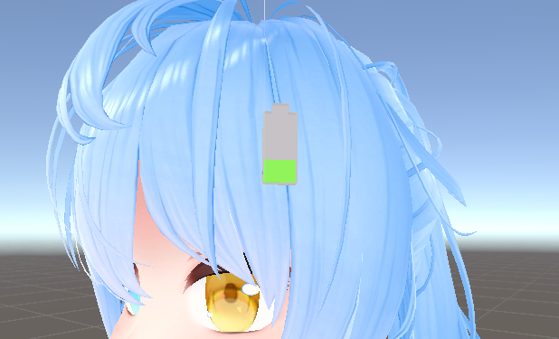

デバイスのバッテリー残量をOSCで送信します

動く
 
・Meta Quest 3 Virtual Desktop 
 
・Thundra Tracker

動かない
 
・Meta Quest 3 Controller
 
・Meta Quest 3 Quest Link (有線・無線)

多分動く
 
・ViveTracker
 
・Index Controller

わからない
 
・上に記載のない全てのデバイス

使用例↓ SampleModel以下にサンプルモデルあります。

